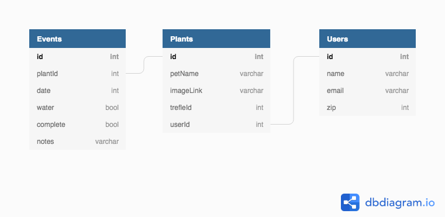
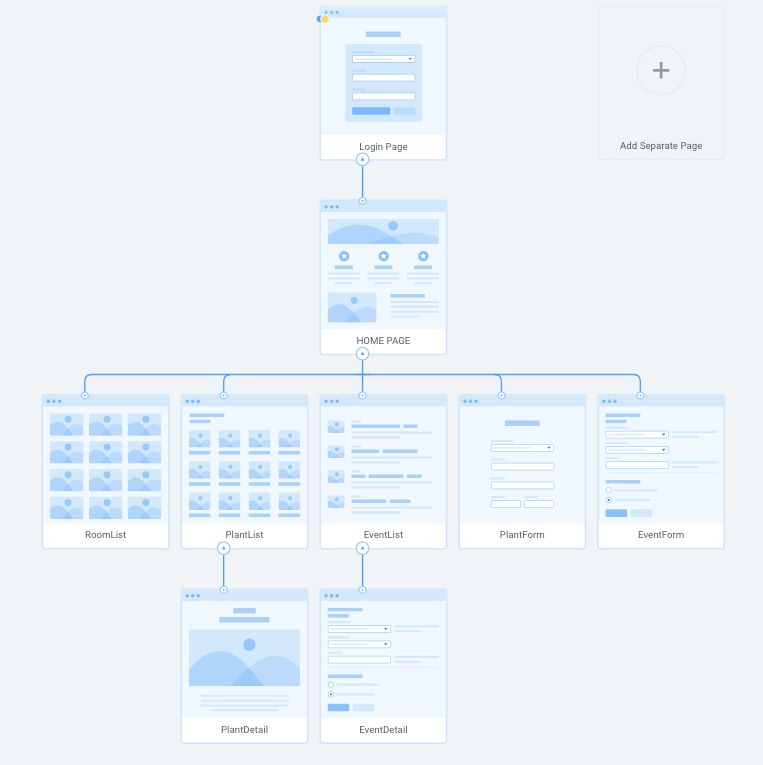

# Happy Plants

## You Gotta Keep ‘Em Hyd-er-rated 

I want to build a plant-watering app to aid budding green-thumbs such as yours-truly in managing their plethoras of personal perennials. Happy Plants will allow users to check in on their plants organized via Plant Cards which will display the last date watered, and if there are any waterings upcoming. Users will be able to sort and display their plants by room, desired sun, or by most/least recently watered.

My own personal desire to create such an app grew out of an incident recently where my favorite succulent Fred almost died because I over-watered him after owning him and taking generally great care of him for 8 years. I used to have a visual board which featured a drawing of each of my succulents/plants and how much light they needed and if they had special watering needs, but my collection of plants has grown so much now that I truly lose track of whom (ie which plant) I have watered when.

I wanted to use the App as an opportunity to create a project whose styling I find truly impeccable. However, I realized that it doesn't make sense to put a nice coat of paint on a car if the car's mechanics are shot. I wanted to build something that looks and feels smooth and professional to use, however the complexity of the navigation and rendering data from two separate APIs proved enough of a challenge that I was unable to dedicate as much energy to styling as I would have liked. Building this App with React gave me the opportunity to teach myself how to use state and props in a basic implementation model. This project taught me how truly little I knew about React and inspired me to continue teaching myself and making this App better.

## ERD v4.0

## Sitemap v1.0

